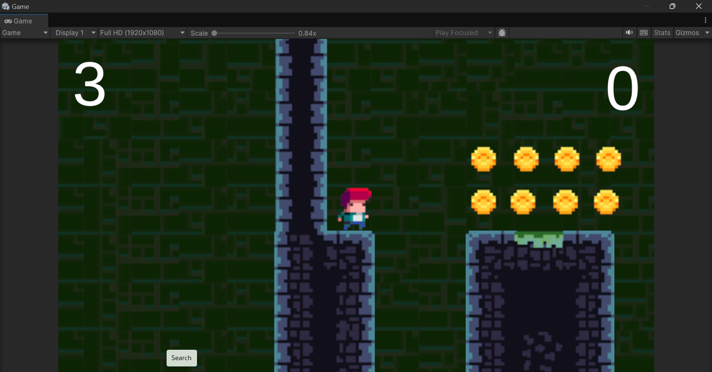
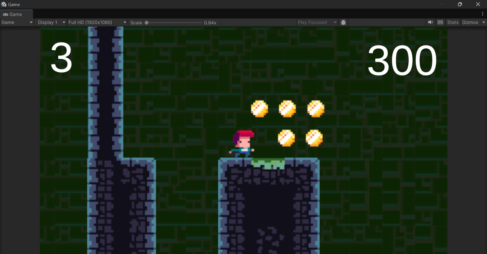
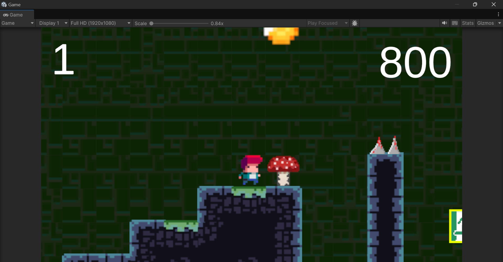
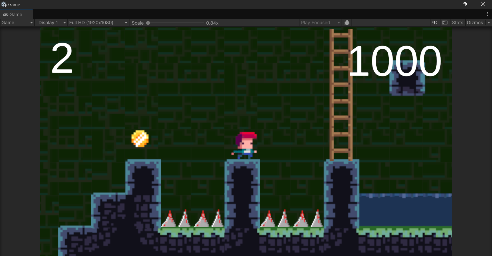
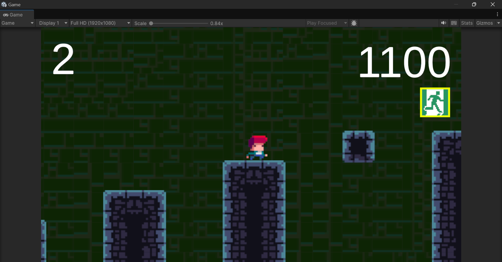
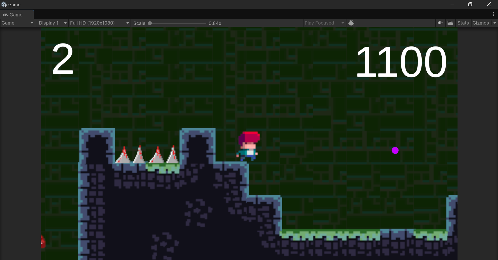
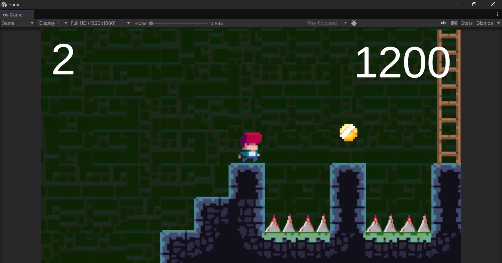
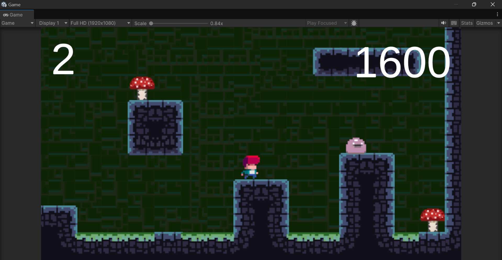
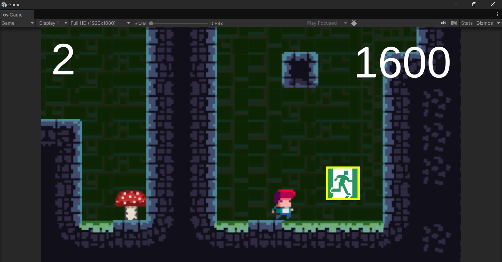

# Project Name

## Overview
This is a Mario + Spelunky fusion game built in unity using C#dd. Below are a series of screenshots showcasing various features and functionalities.

## Screenshots

### Screenshot 1

*Screenshot of gameplay*

### Screenshot 2

*Screenshot of gameplay*

### Screenshot 3

*Screenshot of gameplay*

### Screenshot 4

*Screenshot of gameplay*

### Screenshot 5

*Screenshot of gameplay*

### Screenshot 6

*Screenshot of gameplay*

### Screenshot 7

*Screenshot of gameplay*

### Screenshot 8

*Screenshot of gameplay*

### Screenshot 9

*Screenshot of gameplay*

## Installation

To install this project, follow these steps:

1. Clone the repository:  
   `git clone <repository-url>`

2. Navigate to the project directory:  
   `cd <project-directory>`

3. Open Project using unity

## Usage

- Scripts contain the C# scripts
- Assets has the prefabs, sprites, etc
